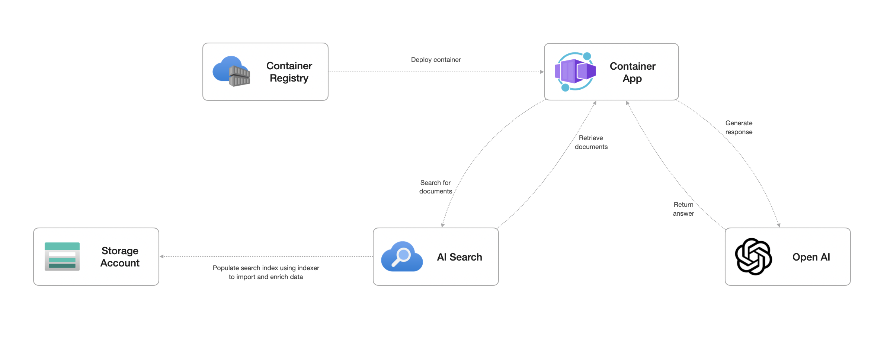

# Getting Started

The purpose of this section is to provide an overview of each example scenario.

## Example Scenario: Contoso Trek Product Info Chatbot (Custom)

### Overview

This example scenario demonstrates a small-scale proof-of-concept deployment of a chatbot leveraging Azure OpenAI and Azure AI Search. It coveres the following key areas:

- Pull-based data ingestion with Azure AI Search
- Custom retrieval-augmented generation (RAG) Implementation
- Built using Streamlit
- Deployed using Azure Container Apps

### Solution Design

The below diagram shows a high-level design for the chatbot leveraging Azure OpenAI, Azure AI Search, deployed as part of an Azure Container App.

The solution consists of the following services:

- **[Azure OpenAI](https://learn.microsoft.com/azure/ai-services/openai/overview)**: Provides the large language model (LLM) capabilities for generating human-like responses based on user queries.
- **[Azure AI Search](https://learn.microsoft.com/azure/search/search-what-is-azure-search)**: Enables efficient retrieval of relevant information from your enterprise knowledge base or data sources.
- **[Container Registry](https://learn.microsoft.com/azure/container-registry/container-registry-intro)**: Used for storing the Docker image.
- **[Container App](https://learn.microsoft.com/azure/container-apps/containers)**: Used for exposing the container as a REST API.

The following open-source Python framework are used in this project:

- **[Streamlit](https://streamlit.io/)**: Facilitates a lightweight and user-friendly deployment experience, making the chatbot readily accessible through a web interface.

### How It Works

The RAG pattern implemented here utilizes Azure AI Search to retrieve the most relevant information based on the user's query. This retrieved information is then fed into the Azure OpenAI LLM, which generates a comprehensive and informative response tailored to the specific context.

The chatbot is built using Streamlit, which provides a simple and intuitive interface for users to interact with the chatbot. The chatbot is deployed using Azure Container Apps, which allows for easy scaling and management of the application.

The [Step-by-Step Setup](.github/docs/step-by-step-setup.md) section of this repository. provides detailed instructions on how to deploy this proof-of-concept.

> [!CAUTION]
> This solution design is intended for proof-of-concept scenarios and is not recommended for enterprise production scenarios. It is advised to review and adjust the design based on your specific requirements if you plan to use this in a production environment. This could include:
>
> - Securing the solution through network controls.
> - Upflift observability by enabling monitoring and logging for different services.
> - Defining an operational support and lifecycle management plan for the solution.
> - Implementing alerting and notification mechanisms to notify support teams of any issues (e.g. performance, budget, etc.).
>
> The Azure Well-Architected Framework provides guidance on best practices for designing, building, and maintaining cloud solutions. For more information, see the [Azure Well-Architected Framework](https://learn.microsoft.com/azure/well-architected/what-is-well-architected-framework).

## Related Resources

- [Azure OpenAI](https://learn.microsoft.com/azure/ai-services/openai/)
- [Azure AI Search](https://learn.microsoft.com/azure/search/)
- [Streamlit](https://streamlit.io/)
- [Azure OpenAI Service REST API reference](https://learn.microsoft.com/azure/ai-services/openai/reference)
- [Securely use Azure OpenAI on your data](https://learn.microsoft.com/azure/ai-services/openai/how-to/use-your-data-securely)
- [Introduction to prompt engineering](https://learn.microsoft.com/azure/ai-services/openai/concepts/prompt-engineering)
- [Prompt engineering techniques](https://learn.microsoft.com/azure/ai-services/openai/concepts/advanced-prompt-engineering?pivots=programming-language-chat-completions)
