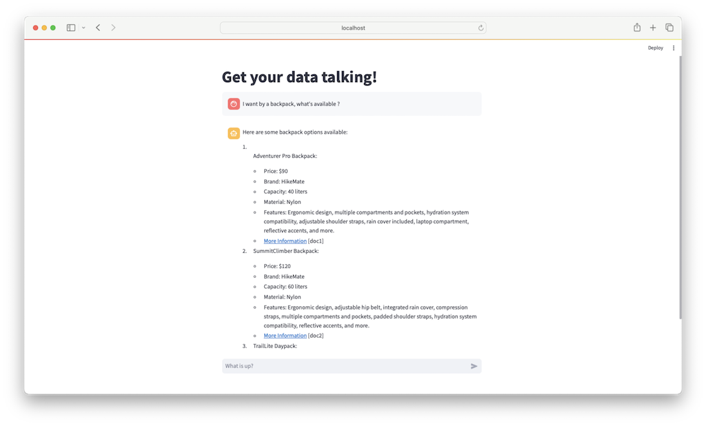

# Step-by-Step Setup

The purpose of this section is to describe the steps required to setup each example scenario.

> [!TIP]
>
> - The following options are recommended to complete the setup:
>   1. Using the [Azure Cloud Shell](https://learn.microsoft.com/azure/cloud-shell/overview) within the Azure Portal.
>   2. Using a [GitHub Codespace](https://docs.github.com/en/codespaces/prebuilding-your-codespaces/about-github-codespaces-prebuilds)
>   3. Using your local VSCode environment with the environment specified in the [development container](https://docs.github.com/en/codespaces/setting-up-your-project-for-codespaces/adding-a-dev-container-configuration/introduction-to-dev-containers). This will be the most efficient way to complete the setup.

> [!WARNING]
>
> - As with all Azure Deployments, this will incur associated costs. Remember to teardown all related resources after use to avoid unnecessary costs.

## Prerequisites

Before implementing this example scenario the following is needed:

- Azure subscription with Owner permissions.
- GitHub account.

## 1. Common Setup

## 1.1. Create a GitHub repository

1. Log in to your GitHub account and navigate to the [azure-open-ai-example-scenarios](https://github.com/nfmoore/azure-open-ai-example-scenarios) repository and click `Use this template` to create a new repository from this template.

    Rename the template and leave it public. Ensure you click `Include all branches` to copy all branches.

> [!NOTE]
>
> - You can learn more about creating a repository from a template [here](https://docs.github.com/en/repositories/creating-and-managing-repositories/creating-a-template-repository).

## 1.2. Deploy Azure resources

1. Run the following command to get your Object ID of your Azure AD user.

    ```bash
    az ad signed-in-user show --query "id" -o tsv
    ```

    This will be used to assign the required permissions needed to interact with the Azure resources during the setup or a development scenario.

2. Click the `Deploy to Azure` button below to deploy the Azure resources required for these example scenarios.

    [](https://portal.azure.com/#create/Microsoft.Template/uri/https%3A%2F%2Fraw.githubusercontent.com%2Fnfmoore%2Fazure-open-ai-example-scenarios%2Fmain%2Finfrastructure%2Fmain.json)

> [!NOTE]
>
> - The Azure AD user requires the `Search Service Contributor ` role and `Search Index Data Contributor` role when creating assets and interacting with Azure AI Search.
> - The Azure AD user requires the `Cognitive Services OpenAI Contributor` role when interacting with Azure Open AI.
> - These roles have been assigned to the Azure AD user in the ARM template used for deployment in step (2).

## 2. Example Scenario Setup

## 2.1. Contoso Trek Product Info Chatbot (Custom)

The [Getting Started](.github/docs/getting-started.md) section of this repository provides an overview of the Contoso Trek Product Info Chatbot (Custom) example scenario.

### 2.1.1. Set environment variables

1. To run this project, you need to configure the following environment variables. These must be stored in a .env file in the root of the project.

    ```bash
    AZURE_SUBSCRIPTION_ID=<your-subscription-id>
    AZURE_RESOURCE_GROUP=<your-resource-group>
    
    AZURE_OPENAI_API_BASE=<your-open-ai-service-name>.openai.azure.com
    AZURE_AI_SEARCH_ENDPOINT=<your-search-service-name>.search.windows.net

    AZURE_OPENAI_CHAT_DEPLOYMENT=gpt-35-turbo-16k-0613
    AZURE_OPENAI_EMBEDDING_DEPLOYMENT=text-embedding-ada-002-2

    AZURE_AI_SEARCH_INDEX_NAME=contoso-trek-product-info-01-index
    AZURE_AI_SEARCH_INDEXER_NAME=contoso-trek-product-info-01-indexer
    AZURE_AI_SEARCH_DATASOURCE_NAME=contoso-trek-product-info-01-datasource
    AZURE_AI_SEARCH_SKILLSET_NAME=contoso-trek-product-info-01-skillset

    AZURE_AI_SEARCH_DATASTORE_NAME=<your-storage-account-name>
    AZURE_AI_SEARCH_DATASTORE_CONTAINER_NAME=data
    AZURE_AI_SEARCH_DATASTORE_CONTAINER_PATH=contoso-trek-product-info
    ```

> [!NOTE]
>
> - The values of the environment variables can be found in the Azure Portal after the deployment of the Azure resources.

### 2.1.2. Configure the Azure AI Search service and query the Azure Open AI

1. Before running the notebooks ensure you authenticate with the Azure CLI by running the following command:

    ```bash
    az login --tenant <your-tenant-id>
    ```

    This will open a browser window to authenticate with the Azure CLI.
2. To create these artifacts to configure the Azure AI Search service run section `1. Populate Azure AI Search Index` of the the `notebooks/example_scenario_01.ipynb` notebook.
3. After the index, skillset, indexer, and datasource have been created, check that the indexer has run successfully and the index has been populated with data in the Azure Portal under the Azure AI Search service.
4. To query Azure Open AI using the RAG pattern run section `2. LLM Queries with Knowledge Base Integration` of the the `notebooks/example_scenario_01.ipynb` notebook. This section uses the custom RAG implementation and contrasts this with the custom RAG implementation.

> [!WARNING]
>
> - Ensure that you can complete this section without any errors before proceeding to the next step.

### 2.1.3. Run the Streamlit app

1. Before running the streamlit app ensure you authenticate with the Azure CLI by running the following command:

    ```bash
    az login --tenant <your-tenant-id>
    ```

    This will open a browser window to authenticate with the Azure CLI.
2. To run the streamlit app locally for testing purposes, you can use the following command:

    ```bash
    streamlit run ./app/main.py
    ```
3. Open your web browser and navigate to `http://localhost:8501` to access the chatbot.



> [!IMPORTANT]
>
> - Ensure that the Azure AI Search service has been populated with data before running the Streamlit app.

### 2.1.4. Deploy the Streamlit app to an Azure Container App

1. Log into the Azure CLI by running the following command:

    ```bash
    az login --tenant <your-tenant-id>
    ```

    This will open a browser window to authenticate with the Azure CLI.

2. Run the following command to authenticate to the Azure Container Registry:

    ```bash
    export CONTAINER_REGISTRY_NAME=<your-acr-name>
    az acr login --name $CONTAINER_REGISTRY_NAME -t
    ```
3. Run the following command to build and push the Docker image to the Azure Container Registry:

    ```bash
    export CONTAINER_IMAGE_NAME=contoso-trek-product-info-chatbot

    az acr build --image $CONTAINER_IMAGE_NAME --registry $CONTAINER_REGISTRY_NAME --file ./app/Dockerfile .
    ```

4. Run the following command to deploy the Azure Container App:

    ```bash
    export CONTAINER_APP_NAME=<your-container-app-name> # will be created after executing the command
    export RESOURCE_GROUP_NAME=<your-resource-group> # can be found on the Azure Portal
    export CONTAINER_APP_ENVIRONMENT_NAME=<your-container-app-environment-name> # can be found on the Azure Portal
    export USER_ASSIGNED_IDENTITY_NAME=<your-user-assigned-identity-name> # can be found on the Azure Portal
    
    export CONTAINER_REGISTRY_HOSTNAME=$CONTAINER_REGISTRY_NAME.azurecr.io
    export USER_ASSIGNED_IDENTITY_ID=$(az identity show --resource-group $RESOURCE_GROUP_NAME --name $USER_ASSIGNED_IDENTITY_NAME | jq '.id' -r)
    export USER_ASSIGNED_IDENTITY_CLIENT_ID=$(az identity show --resource-group $RESOURCE_GROUP_NAME --name $USER_ASSIGNED_IDENTITY_NAME | jq '.clientId' -r)

    export AZURE_OPENAI_API_BASE=<your-open-ai-service-name>.openai.azure.com # can be found on the Azure Portal
    export AZURE_OPENAI_CHAT_DEPLOYMENT=gpt-35-turbo-16k-0613
    export AZURE_OPENAI_EMBEDDING_DEPLOYMENT=text-embedding-ada-002-2

    export AZURE_AI_SEARCH_ENDPOINT=<your-search-service-name>.search.windows.net # can be found on the Azure Portal
    export AZURE_AI_SEARCH_INDEX_NAME=contoso-trek-product-info-01-index

    az containerapp create \
        --name $CONTAINER_APP_NAME \
        --resource-group $RESOURCE_GROUP_NAME \
        --environment $CONTAINER_APP_ENVIRONMENT_NAME \
        --user-assigned $USER_ASSIGNED_IDENTITY_ID \
        --registry-identity $USER_ASSIGNED_IDENTITY_ID \
        --registry-server $CONTAINER_REGISTRY_HOSTNAME \
        --image $CONTAINER_REGISTRY_HOSTNAME/$CONTAINER_IMAGE_NAME \
        --target-port 8501 \
        --ingress 'external' \
        --max-replicas 2 \
        --env-vars AZURE_OPENAI_API_BASE=$AZURE_OPENAI_API_BASE AZURE_OPENAI_CHAT_DEPLOYMENT=$AZURE_OPENAI_CHAT_DEPLOYMENT AZURE_OPENAI_EMBEDDING_DEPLOYMENT=$AZURE_OPENAI_EMBEDDING_DEPLOYMENT AZURE_AI_SEARCH_ENDPOINT=$AZURE_AI_SEARCH_ENDPOINT AZURE_AI_SEARCH_INDEX_NAME=$AZURE_AI_SEARCH_INDEX_NAME AZURE_CLIENT_ID=$USER_ASSIGNED_IDENTITY_CLIENT_ID
    ```

5. After the deployment is complete, navigate to the Azure Container App URL to access the chatbot.
6. [Optional] Run the following command to update the Azure Container App after it has been deployed:

    ```bash
    az containerapp update \
    --name $CONTAINER_APP_NAME \
    --resource-group $RESOURCE_GROUP_NAME \
    --image $CONTAINER_REGISTRY_HOSTNAME/$CONTAINER_IMAGE_NAME \
    --max-replicas 2
    ```

> [!IMPORTANT]
>
> - Ensure that the Azure AI Search service has been populated with data before deploying the Streamlit app to an Azure Container App.
> - Steps (3), (4) and (6) require environment variables that were set in prior steps.
